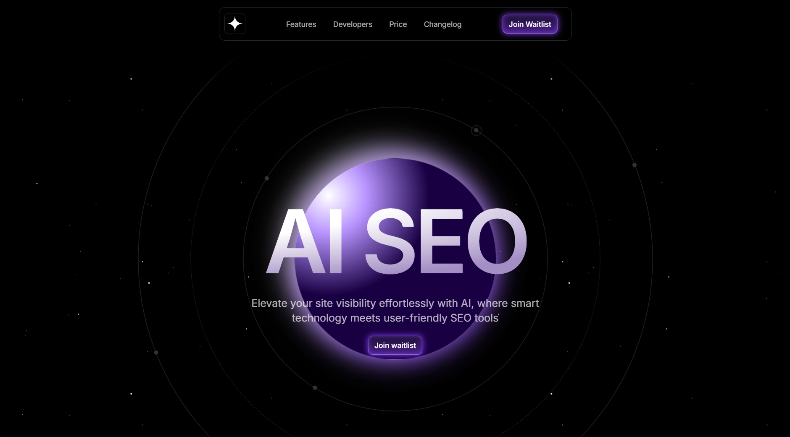

## [Checkout the project](https://horizon-landing-page-heyitsadityaa-adityas-projects-b1f0cfa2.vercel.app/)

## <a name="table">Table of Contents</a>

1. [Introduction](#introduction)
2. [Tech Stack](#tech-stack)

## <a name="introduction">Introduction</a>

Horizon is a sleek and dynamic landing page designed to introduce an AI-powered SEO platform that elevates website visibility with smart and user-friendly tools. Built with Framer Motion for smooth animations and interactions, this landing page showcases the key features of the platform, such as one-click optimization, smart keyword generation, and a user-friendly dashboard

## <a name="tech-stack">Tech Stack</a>

- Next.js(14.2.5)
- React(^18)
- Typescript(^5)
- TailwindCSS(^3.4.1)
- Framer motion(^11.3.2)
